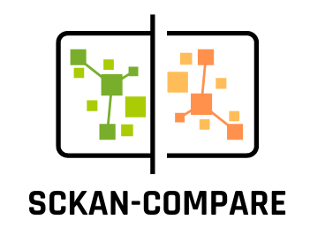

# SCKAN-Compare

Python package and web app to retrieve and visualize data contained in SCKAN (e.g., across species, relationship to spinal segments) to highlight similarities and differences in neuronal pathways.

[](https://opensource.org/licenses/Apache-2.0)
[](https://badge.fury.io/py/sckan-compare)
[](https://doi.org/10.5281/zenodo.8223110)

<p align="center">
  
</p>

## Project Objective

The SPARC Connectivity Knowledge Base of the Autonomic Nervous System (SCKAN) is a semantic store that houses a comprehensive knowledge base of the autonomic nervous system (ANS) nerve-to-end organ connectivity. It is a key component of the SPARC Program and provides a central location to populate, discover, and query ANS connectivity knowledge at multiple scales. The information in SCKAN is derived from SPARC experts, SPARC data, literature, and textbooks.

### SCKAN Limitations
  
Despite the invaluable wealth of data within SCKAN, its practical utility has been somewhat hindered by certain limitations. One of the major challenges faced by researchers is the absence of an easy-to-use visualization tool to represent the intricate neuronal pathways effectively. Existing tools like AC map (https://sparc.science/maps?type=ac) have provided interactive map visualization, but they fall short of integrating the complete data available within SCKAN, limiting their utility in comprehensive exploration.

### Solution

SCKAN-Compare is a tool to retrieve and visualize data contained in SCKAN to highlight similarities and differences in neuronal pathways.

It includes multiple features including:

  - Visualize neuronal pathways
    
  - Compare species
    
  - Phenotypic Relation :
    
        - gain valuable insights into the similarities and differences in brain organization and connectivity across species;
        - understand how findings from mouse/rat studies may translate to human brain function and behavior;
        - help validate the accuracy of these models and ensure that the neural circuits under investigation are relevant to the human condition.
    
## Benefits

Comparing neuronal pathways between humans and model organisms (Mice, Rats) can have numerous benefits for scientists studying neuroscience and related fields.

Here are some of the key advantages:

- gain valuable insights into the similarities and differences in brain organization and connectivity across species.
  
- understand how findings from mouse/rat studies may translate to human brain function and behavior.
  
- help validate the accuracy of these models and ensure that the neural circuits under investigation are relevant to the human condition.

## Installation

SCKAN-Compare is included in the PyPI package index. You can therefore install it with the pip utility:

```
pip install sckan-compare
```

For more detailed instructions, please check the [documentation](https://sckan-compare.readthedocs.io/en/latest/installation.html)

### Video Demonstration

You can get a quick overview of the tool via the following video:

 Todo : << ADD YOUTUBE LINK >>
 
## Documentation
 
Documentation for SCKAN-Compare can be accessed at:
https://sckan-compare.readthedocs.io/

It provides a more detailed insight into the methodology and approach adopted. Instructions for installation are also provided.
 
## SCKAN-Compare vs existing tools

The table provides a summary of the advantages of SCKAN-Compare over other existing tools, such as AC map and SPARClet.


| Feature             | Tool            | AC map | SPARClet |
|---------------------|-----------------|--------|----------|
| Map                 | Yes             | Yes    | Yes      |
| Compare species     | Yes             | No     | No       |
| Phenotypic Relation | Yes             | No     | No       |


## Citation

Hiba Ben Aribi, Pranjal Garg, Gautam Kumar, & Shailesh Appukuttan. (2023). SCKAN-Compare (0.0.6). Zenodo. https://doi.org/10.5281/zenodo.8223110

## Reporting Issues or Contributions
To report an issue or suggest a new feature, please use the issues page. Please check existing issues before submitting a new one.

## Contribute to Project

You can offer to help with the further development of this project by making pull requests on this repo. To do so, fork this repository and make the proposed changes. Once completed and tested, submit a pull request to this repo. 


## License
Apache License 2.0


## Team Members
(in alphabetical order)
- [Gautam Kumar](https://github.com/gogu07)
- [Hiba Ben Aribi](https://github.com/HibaBenAribi)
- [Pranjal Garg](https://github.com/Neurogarg/)
- [Shailesh Appukuttan](https://github.com/appukuttan-shailesh/)
